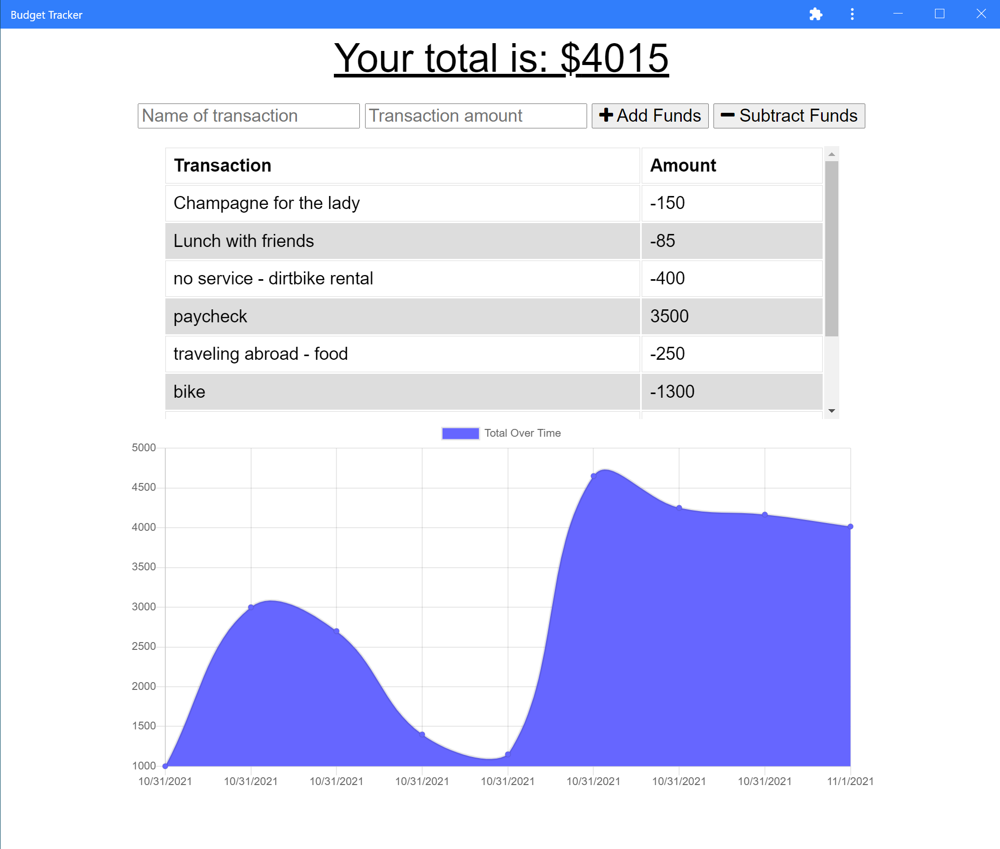

# Budget Tracker (On/Off-Line)
  
  
  
  ## Description
  A simple budget tracker to keep track of deposits and expenses. Transactions are stored in indexedDB when offline and when network access is restored, they are logged in the server database. This allows the user to maintain their budget, even when offline or out of service territory. 

  

  ## Table of Contents
  * [Installation](#installation)
  * [Usage](#usage)
  * [Contributing](#contributing)
  * [Tests](#tests)
  * [License](#license)
  * [Questions](#questions)
  
  ## Installation
  Clone the repo, ensure all npm packages are installed

  ## Usage
  npm start will then utilize a pre-start script to create the dist folder and files. The server will then start. The application is also created as a PWA and can be saved as such for independent use. 

  ## Contributing
  N/A

  ## Tests
  N/A

  ## License
  MIT License
  

  ## Questions
  If you have questions, you can reach me via Github:
  [irv0735](https://github.com/irv0735)

  Or contact via email:
  irv0735@gmail.com

